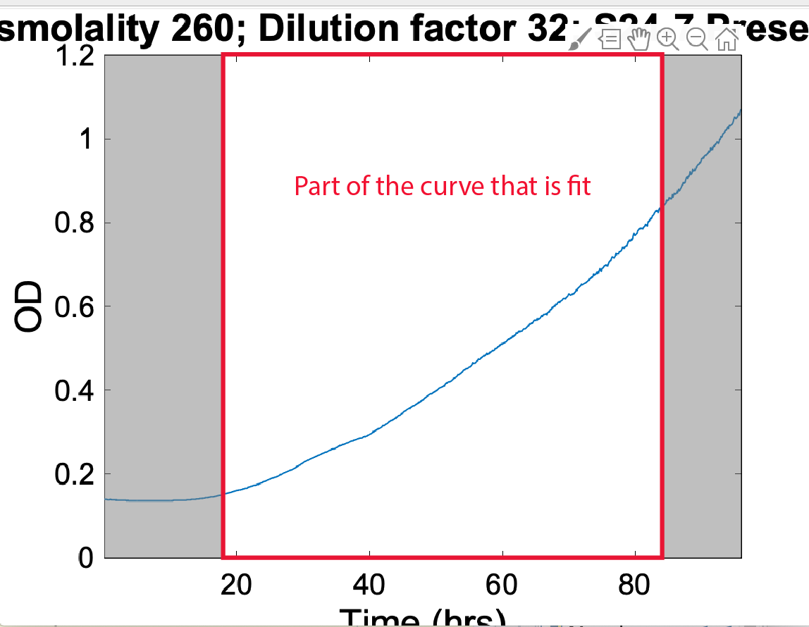
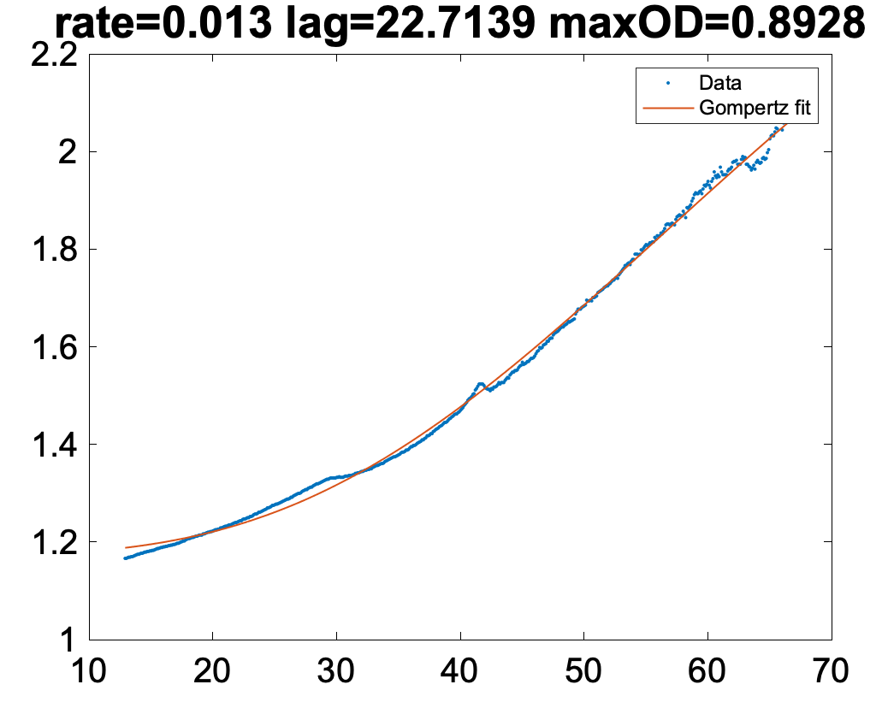

# Analysis of growth curves

by Carolina Tropini

Please submit bug reports to carolina.tropini@ubc.ca with a screenshot of the error and your input data.

## Data format

**Export from Biotek such that each well is a column and every row is time**.

Prior to analyzing with the MATLAB script, make sure the data has no tables underneath the last time point

Add the metadata on top.

The final file should have this format:

**IMPORTANT**:  

**There should be just one sheet in the file to be analyzed.**

the first row of metadata should have numbers, not text. If you don't have metadata with numbers just add a mock metadata with all 1s.

**There should also be a numeric Samples/Controls metadata row**. In the example it is S24-7 Present. Controls should be listed as 0. Any other numbers can be used to list other strains.

**Note: Samples/Controls metadata row should be numeric for Carolina’s new code of detecting new outliers (0 - for control). Additionally, if running more replicates of the same strain differentiate the name of the strain if you want the data not to be considered one run! (i.e. tested *Lactobacillus rhamnosus GG* twice, label *Lactobacillus rhamnosus GG* 1, *Lactobacillus rhamnosus GG* 2)**

**These options for metadata are experiment-specific, none of these labels are necessary. Only real requirements are that the first row needs to be numbers, and secondly you need to know if it will be a sample (1,2,..,N) or a control (0).**

Make sure all the columns have metadata associated with them and that there are no stray tables at the bottom of your sheet! Those will make the program crash.

To speed up the analysis, if you have wells that are empty (not controls and wells that generally have no data in there) remove them from the excel file directly so that they are not included in the analysis.

## Analyzing using General_plate_reader_analysis

### Current version: 7/15/2022

[General_plate_reader_analysis_v1p3.m](Scripts/General_plate_reader_analysis_v1p3.m)

[Gompertz_plate_reader.m](Scripts/Gompertz_plate_reader.m)

### Required additional programs to be in path

[Gompertz.m](Scripts/Gompertz.m)

[make_white_fig.m](Scripts/make_white_fig.m)

[boundedline.m](Scripts/boundedline.m)

[brewermap.m](Scripts/brewermap.m)

[inpaint_nans.m](Scripts/inpaint_nans.m)

### Procedure

1. Double click on `General_plate_reader_analysis_beta.m`
2. Click run.
3. Select xlsx file of interest (format described above).

    **If you have already analyzed this file go to point 10.**

    Now select the type of background subtraction:

    

    **From control**: Here it really matters what categories get selected in points 4 and 5 because if you choose the subtraction from the control it will average all available controls for that well based on the categories selected and subtract that from the current well data.

    If you select this and you don't have controls it will automatically subtract the first time-point.

    **From first time point**: subtracts single number

    **None**: no subtraction

    Now select whether you want to keep all replicates or the 3 most consistent ones.

    

    If you have more than 3 replicates for each unique condition selecting yes will keep the 3 most consistent ones for calculating statistics and plotting. Selecting no will include everything in the stats and plotting. For controls this selection is not done.

4. Select metadata the data should be analyzed upon.
For the example above, we want to separate data based on Osmolality, Media Type and whether S24-7 is present, but we want to average across Well Type, Media Type and Dilution factor.

    

5. Click Ok. Select the Metadata describing samples (non 0) vs. control (0), here S24-7 Present

    

6. Choose whether you want to fit the data to extract growth rate and maximum OD
If you choose yes, the program will now average curves based on the metadata selected and fit the individual curves to extract lag time, growth rate and maximum OD.
If you choose No, the program will go on to step 8.

    

7. If you chose to use background subtraction from the controls a new figure will show up, showing you what the control and subtracted curve look like. A dialog will show up asking you to accept this subtraction ("Keep as shown") or change to the subtracting only the first time point ("Subtract first time point only"). Here is an example of one case in which subtraction from the control should be rejected: the OD of the control is higher than that of the sample and there is a weird artifact at the beginning of the read in the control.

    

    Once you have made either choice (or none in the case of no background subtraction) you will see a new window with a plot of the figure to fit.

    Use the cursor to select where the fit will be taking place. You can click anywhere, only the time axis will be affected. You will have to pick a start and an end point, and the region that will be selected is the one that is not grayed out. If you choose incorrectly, select "No, pick new points" when the prompt comes up. For curves that have multiple parts I recommend choosing from before the first exponential growth to the first settling point.

    <aside>
    📐 The fit we perform is to the Gompertz curve, here are a couple of papers about it!

    [Appl Environ Microbiol 1990 Zwietering.pdf](Papers/Appl_Environ_Microbiol_1990_Zwietering.pdf)

    [Tjørve, Tjørve - 2017 - The use of Gompertz models in growth analyses, and new Gompertz-model approach An addition to the Unified-Rich.pdf](Papers/Tjrve_Tjrve_-_2017_-_The_use_of_Gompertz_models_in_growth_analyses_and_new_Gompertz-model_approach_An_addition_to_the_Unified-Rich.pdf)

    </aside>

    

    

    

    From here the program will fit the curve and then ask you whether to keep the fit values ("Yes") or try another fit and delete the current one ("Try another fit"), or flag curve ("Go to next and flag") on the top left corner of the screen:

    

    Exit will stop the program but the output (info below) will still be made, with 0s where the fits have not been made.

    ### What is a good enough fit?

    The main thing you will be fitting for is the rate - so the slope of the red curve (the fit). It's not necessary that all the blue line is perfectly under the red line, but the trends have to match closely. We will eventually implement a standard error selection, but for now here are two examples of acceptable and unacceptable fits:

    ### **Acceptable: the rates match between data and fit (particularly at the steepest part of the curve)**

    

    

    ### **Flagged: the rate of the fit (red line) does not match the slope of the data (blue)**

    

    Another potential issue: noise - make sure to fit to the real data

    

    In cases of low growth fit over a long enough time not to get artificially high growth rates based on step variations in the data! **In general LOOK at the rate and see if it makes sense compared to the rest of your data!**

    

    Once you have done the fit choice, you will have an output in the folder where the data is stored with name *data_file_name*_fits.xlsx. This file includes all the metadata plus a couple extra columns:

    

    - OD_max_overall (this is the mathematical max of the entire OD curve, which may or may not be more useful than the fitted ones)
    - rate (fitted rate)
        - OD/hour
        - Convert to doubling time - Log2*rate
    - OD_max (fitted max OD)
    - flag (this is the one selected above if the fit was not liked by the user, if you flagged it flag=1 otherwise 0).

    Controls are not fit so the fitted numbers (rate and OD_max) are equal to 0.

    Right now if you want to average the different rate and OD_max together you have to do it yourself, either from the excel file or Matlab, the automation of this will be something for a later implementation of the code.

8. Now you can select what to plot by clicking on the checkmarks and clicking the `Plot selected` button.

    

    

9. To modify the figure you can either export it to eps and change the appearance of lines on Illustrator, of change the Figure Properties as below.

    

10. If you have analyzed this file before it will give you the following options:

    

    **Start over** gets you back to point  3.

    **Continue where I left off** keeps all the fits and settings you had previously chosen and continues where it left off in the loop.

    **Exit script** gets out from the script.

At this point, once you have generated the _fits.xlsx file you can go on with the analysis!
